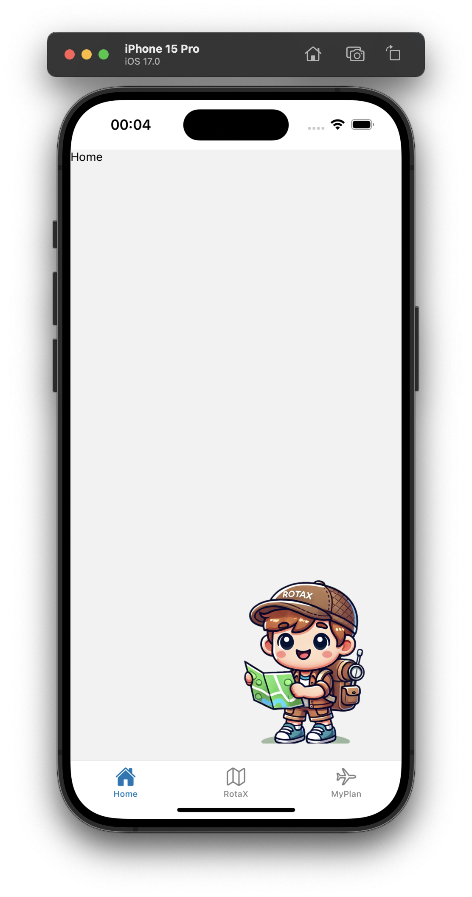
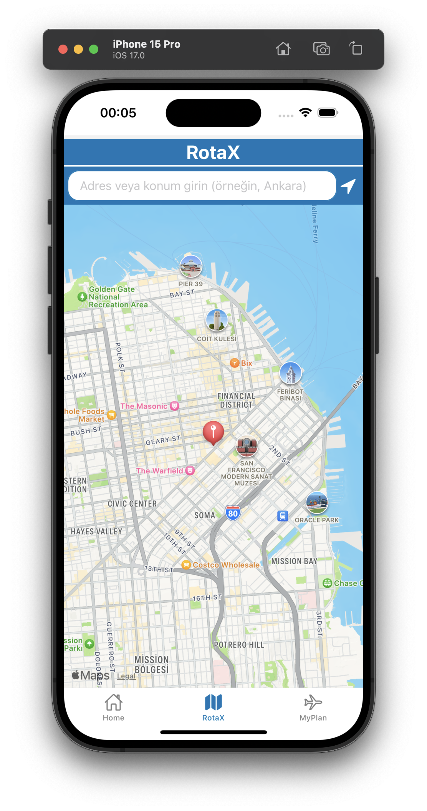

# RotaX

RotaX, gezilerinizde rotalar oluşturmanızı ve planlama yaparken notlar almanızı sağlayan bir mobil uygulamadır. React Native ve .NET teknolojileriyle geliştirilen uygulama, seyahat deneyiminizi iyileştirmek için harita tabanlı özellikler ve kullanıcı dostu bir arayüz sunar.


## Özellikler

- **Adres Arama ve Harita Görüntüleme**: Kullanıcı, haritada konum araması yapabilir ve istediği adresleri görüntüleyebilir.
- **Konum İşaretleme**: Girilen adres veya konum bilgisi harita üzerinde işaretlenir.
- **Planlama ve Not Alma**: Her bir rota için notlar alarak seyahatinizi daha iyi organize edebilirsiniz.
- **React Native ve .NET Entegrasyonu**: Uygulama, mobil arayüz için React Native, backend işlemleri için .NET teknolojilerini kullanır.
- **Kullanıcı Dostu Arayüz**: Basit ve şık bir arayüz ile kolay bir kullanım deneyimi sağlar.

## Kurulum

RotaX uygulamasını çalıştırmak için aşağıdaki adımları takip edebilirsiniz:

### Gereksinimler

- **Node.js**: [Node.js](https://nodejs.org) yüklü olmalıdır.
- **Expo CLI**: `npm install -g expo-cli` komutuyla yükleyin.
- **.NET SDK**: Backend için .NET SDK gereklidir.

### Adımlar

1. **Projeyi Klonlayın**:
```bash
   git clone https://github.com/kullanici-adi/rotaX.git
   cd rota
```
2. **Bağımlılıkları Yükleyin**:
```bash
   npm install
```
3. **Expo ile Uygulamayı Başlatın**:
```bash
expo start
```

4. **Uygulamayı Çalıştırın**: Expo'nun sağladığı QR kod ile uygulamayı telefonunuzda açabilir veya bir Android/iOS emülatöründe çalıştırabilirsiniz.

### Uygulama Görselleri



